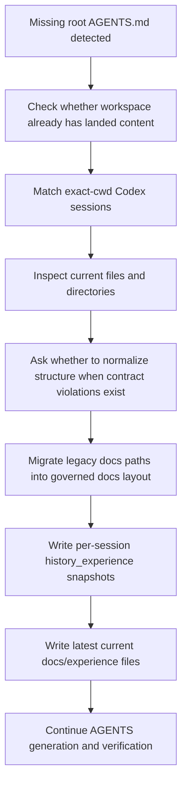

# Workflow Experience

## Evidence Read
- Scope: matched session 019e86a0-58a0-7ae2-9c4d-0ed150f24ed3.
- Matched Codex sessions (exact cwd only): 019e86a0-58a0-7ae2-9c4d-0ed150f24ed3.
- Current repository facts discovered from the working directory.
- Existing repository files and directories that were already present before AGENTS governance scaffolding.

### Matched Session Files
- `/Users/henry/.codex/sessions/2026/06/02/rollout-2026-06-02T12-38-35-019e86a0-58a0-7ae2-9c4d-0ed150f24ed3.jsonl`

### Current Workspace Evidence
- `.DS_Store`
- `.agentmd`
- `.agents/agents-control.json`
- `.agents/design-interview-state.json`
- `.agents/docs-governance-state.json`
- `.agents/global-rule-overrides.json`
- `.agents/script-governance-exceptions.json`
- `.gitignore`
- `.gradle/8.13/checksums/checksums.lock`
- `.gradle/8.13/checksums/md5-checksums.bin`

### Session Excerpts
### Session `019e86a0-58a0-7ae2-9c4d-0ed150f24ed3`
- User: Hi Codex, excellent teardown. This is Round 2. I fully accept your restructuring: Stage 1a (AI Core + Encrypted Settings) -> Stage 1b (Skeleton Compose UI) -> Stage 2 (SQLDelight + ViewModel) -> Stage 1c (UI Polish/Anima
- Assistant: Excellent question — you've put your finger on the exact tension point. Let me give you a straight critique. ## Your proposal: `key` + `@Immutable` data classes **You're 70% right, but there's a critical gap.** ### What 

## Task Context
- The current working directory already contained project content but did not yet contain a root `AGENTS.md`. This bootstrap experience records how the existing code and the exact-cwd Codex session history should be read together before the workspace is normalized.
- This `Workflow` record is generated from session evidence plus landed repository content so future agents can understand what work was underway, what files mattered, and what governance repairs were required.

## How To Apply
- First inspect whether the root `AGENTS.md` is missing and whether the workspace already contains meaningful files or directories.
- Then read only the Codex sessions whose `session_meta.payload.cwd` exactly matches the current working directory; do not mix in adjacent or similarly named workspaces.
- Use the matched sessions to reconstruct the recent user intent, combine that with the current file tree, and only then create the governed docs layout, latest experience files, and any required structure migration plan.
- If directory structure is not compliant, ask whether to normalize it before changing files. The recommended default is yes, but the confirmation must still be explicit.

## Problems And Risks
- If session matching is too broad, another repository's history can contaminate the current experience files and make the generated AGENTS guidance unsafe.
- If the workspace layout is normalized without asking first, the agent can silently move the wrong files or create governance output in the wrong place.
- If only the current file tree is used and the Codex session history is ignored, the resulting experience files can miss the real reason the repository is in its current partial state.

## Iterated Lessons
- 完整流程链: detect missing root AGENTS.md -> confirm the workspace already has landed content -> read exact-cwd Codex sessions -> extract user and assistant intent from those sessions -> inspect the current file tree -> ask whether to normalize structure when the layout violates the contract -> migrate legacy docs paths -> generate history experience snapshots per matched session -> synthesize the latest current experience set -> continue with AGENTS generation and verification.
- 完整逻辑链: the working directory is the identity boundary; the exact cwd selects the session transcripts; the transcripts explain why current files exist; the current files confirm what was actually landed; the structure gate decides whether reorganization must be confirmed; the docs bootstrap turns those inputs into governed memory under `docs/experience/` and `docs/experience/history_experience/`.
- 闭环: if exact-cwd sessions are found, archive them as historical experience first; if no exact-cwd sessions are found, mark the conversation context as missing and generate the latest experience from landed files only; if structure is invalid, stop and ask before reorganizing; after normalization, regenerate current experience so the governed state reflects the repaired repository.
- For path handling, always render workspace evidence as normalized repository-relative paths such as `src/main.py` or absolute filesystem paths with real separators. Never collapse them into unreadable joined strings.

## Next Application
- Reuse this bootstrap only for workspaces that already contain real content but still lack a root `AGENTS.md`.
- Keep the exact-cwd rule strict so that neighboring repositories never leak into the current experience set.
- After the initial bootstrap, switch back to the normal handoff and experience cadence instead of regenerating history on every run.
