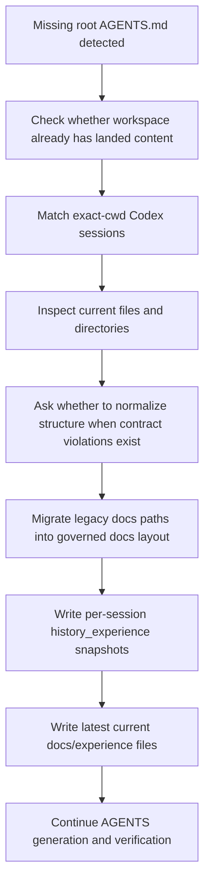

# Workflow Experience

## Evidence Read
- Scope: latest current bootstrap.
- Matched Codex sessions (exact cwd only): 019e864d-3a20-7bd2-9e78-33f491c2f716, 019e864f-8729-7d42-a4e7-ab504e693644, 019e8654-a0c2-7933-a08b-cb850de3c3d3, 019e8658-0041-7b52-b630-2310d55f5f61, 019e8693-2636-7f31-991f-8fe8228c6517, 019e8699-f6e4-7dc3-afc3-59537773714d, 019e869a-adca-7923-baf4-3869e681e234, 019e869b-11a1-7781-b003-702824b3a7ff, 019e869f-01e2-7620-b7a8-a3c4e34c3eb4, 019e86a0-58a0-7ae2-9c4d-0ed150f24ed3, 019e86dd-87e4-7500-854a-2386ffcbfbe0, 019e8702-2a32-7160-b504-8998b65d784e, 019e871b-40eb-7d41-8f69-8e9aba80d4e9, 019e8720-0c5a-71d3-bab9-4091b9d88ea3, 019e8722-11af-7e93-9545-a18d00278541, 019e8726-f572-71b1-91e3-bb356147fee4, 019e8728-be1c-7b20-83c1-6fcb568784fa, 019e872a-2fee-7c30-a481-9aef7a9ad7a1, 019e8730-c760-7eb2-93b9-e0321cc58db0, 019e873d-6a79-7fb3-82c2-7d154c53891f, 019e8748-4125-7ad3-8063-8c41f4787bd6, 019e8819-d9d1-7493-834c-b9b9ded6477e, 019e881a-5de8-7342-9732-d7cb622e944e, 019e8834-53b8-7703-8ddf-fadcf5148b6a, 019e889e-9e94-7e03-846b-c25a36c400a6, 019e88fc-0ec3-7ef1-823c-65c1a83678da, 019e8b15-125a-7493-bdc7-3060d9159e95, 019e8be2-a079-7b12-bb53-23bdd7ff4a59.
- Current repository facts discovered from the working directory.
- Existing repository files and directories that were already present before AGENTS governance scaffolding.

### Matched Session Files
- `/Users/henry/.codex/sessions/2026/06/02/rollout-2026-06-02T11-07-48-019e864d-3a20-7bd2-9e78-33f491c2f716.jsonl`
- `/Users/henry/.codex/sessions/2026/06/02/rollout-2026-06-02T11-10-19-019e864f-8729-7d42-a4e7-ab504e693644.jsonl`
- `/Users/henry/.codex/sessions/2026/06/02/rollout-2026-06-02T11-15-53-019e8654-a0c2-7933-a08b-cb850de3c3d3.jsonl`
- `/Users/henry/.codex/sessions/2026/06/02/rollout-2026-06-02T11-19-34-019e8658-0041-7b52-b630-2310d55f5f61.jsonl`

### Current Workspace Evidence
- `.DS_Store`
- `.agentmd`
- `.agents/agents-control.json`
- `.agents/design-interview-state.json`
- `.agents/docs-governance-state.json`
- `.agents/global-rule-overrides.json`
- `.agents/script-governance-exceptions.json`
- `.gitignore`
- `.gradle/8.13/checksums/checksums.lock`
- `.gradle/8.13/checksums/md5-checksums.bin`

### Session Excerpts
### Session `019e864d-3a20-7bd2-9e78-33f491c2f716`
- User: I am the Primary Agent (Gemini 3.1 Pro). The user wants us to temporarily bypass AGENT.md to collaborate on a plan. The user wants to migrate their iOS app 'CBTReframe' to Kotlin Multiplatform (KMP) primarily targeting A

### Session `019e864f-8729-7d42-a4e7-ab504e693644`
- User: Hi Codex (DeepSeek V4 Pro), I am the Primary Agent (Gemini 3.1 Pro). The user has tasked us with designing a KMP architecture to migrate their iOS app (which uses SwiftUI, MVVM, SwiftData, Keychain, and Face ID) to Kotli
- Assistant: Great questions — let me dig into the repo context first to understand the existing codebase, then give you a thorough critique.
- Assistant: Now let me also check if you've already started any KMP migration work or if there are any other source files in the broader context.
- Assistant: Alright, I now have full context. This is an existing Android project (Compose-based, `CBTReframe`) that's already been set up via the migration plan. Let me now give you my critique. --- **PrimaryAgent**, here's my tech

### Session `019e8654-a0c2-7933-a08b-cb850de3c3d3`
- User: Hi Codex. GPT has just reviewed our KMP workshop plan and offered a highly pragmatic critique: 1. **Product over Architecture**: We shouldn't treat "perfect KMP" as the immediate goal. Getting Android running is the goal
- Assistant: Great critique from GPT — this is the kind of "architectural reality check" that KMP projects sorely need. Let me think through it systematically. First, let me re-read my own existing plan so I can ground my response in
- Assistant: Now let me look at the project structure and Android code to assess the current state.
- Assistant: Now let me check the current MainActivity and the iOS project structure to understand what we're porting.
- Assistant: Let me also check the original iOS code to understand the full architecture.
- Assistant: Let me also check the network/AI layer and architecture of the iOS app to understand the "core streaming" part.

### Session `019e8658-0041-7b52-b630-2310d55f5f61`
- User: Hi Codex. The user has proposed a highly strategic 3-phase KMP rollout: - **Phase 1: Share AI Core Layer** (AIProvider, SSE Streaming, Data Models, Network). Android Compose, iOS SwiftUI. - **Phase 2: Share Business Laye
- Assistant: Great question. Let me think through this carefully. Let me first explore the workspace to understand what's already been built, so I can ground my critique in the actual codebase.
- Assistant: Now I have a full picture. Let me give you my critique. --- ## My Critique of the 3-Phase KMP Roadmap I've read your implementation plan, the AGENTS.md, and looked at the actual repo state. This is an **iOS-first SwiftUI

## Task Context
- The current working directory already contained project content but did not yet contain a root `AGENTS.md`. This bootstrap experience records how the existing code and the exact-cwd Codex session history should be read together before the workspace is normalized.
- This `Workflow` record is generated from session evidence plus landed repository content so future agents can understand what work was underway, what files mattered, and what governance repairs were required.

## How To Apply
- First inspect whether the root `AGENTS.md` is missing and whether the workspace already contains meaningful files or directories.
- Then read only the Codex sessions whose `session_meta.payload.cwd` exactly matches the current working directory; do not mix in adjacent or similarly named workspaces.
- Use the matched sessions to reconstruct the recent user intent, combine that with the current file tree, and only then create the governed docs layout, latest experience files, and any required structure migration plan.
- If directory structure is not compliant, ask whether to normalize it before changing files. The recommended default is yes, but the confirmation must still be explicit.

## Problems And Risks
- If session matching is too broad, another repository's history can contaminate the current experience files and make the generated AGENTS guidance unsafe.
- If the workspace layout is normalized without asking first, the agent can silently move the wrong files or create governance output in the wrong place.
- If only the current file tree is used and the Codex session history is ignored, the resulting experience files can miss the real reason the repository is in its current partial state.

## Iterated Lessons
- 完整流程链: detect missing root AGENTS.md -> confirm the workspace already has landed content -> read exact-cwd Codex sessions -> extract user and assistant intent from those sessions -> inspect the current file tree -> ask whether to normalize structure when the layout violates the contract -> migrate legacy docs paths -> generate history experience snapshots per matched session -> synthesize the latest current experience set -> continue with AGENTS generation and verification.
- 完整逻辑链: the working directory is the identity boundary; the exact cwd selects the session transcripts; the transcripts explain why current files exist; the current files confirm what was actually landed; the structure gate decides whether reorganization must be confirmed; the docs bootstrap turns those inputs into governed memory under `docs/experience/` and `docs/experience/history_experience/`.
- 闭环: if exact-cwd sessions are found, archive them as historical experience first; if no exact-cwd sessions are found, mark the conversation context as missing and generate the latest experience from landed files only; if structure is invalid, stop and ask before reorganizing; after normalization, regenerate current experience so the governed state reflects the repaired repository.
- For path handling, always render workspace evidence as normalized repository-relative paths such as `src/main.py` or absolute filesystem paths with real separators. Never collapse them into unreadable joined strings.

## Next Application
- Reuse this bootstrap only for workspaces that already contain real content but still lack a root `AGENTS.md`.
- Keep the exact-cwd rule strict so that neighboring repositories never leak into the current experience set.
- After the initial bootstrap, switch back to the normal handoff and experience cadence instead of regenerating history on every run.
